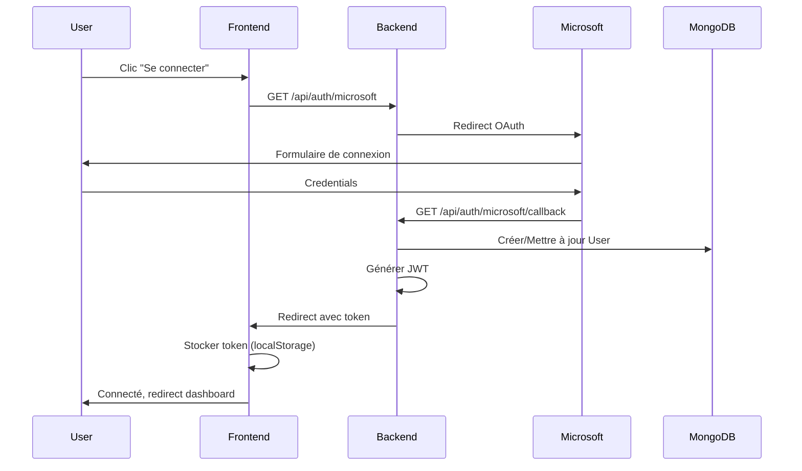

# Hub Project Platform - Documentation Complète

## Table des Matières

1. [Vue d'ensemble](#vue-densemble)
2. [Architecture du Projet](#architecture-du-projet)
3. [Stack Technologique](#stack-technologique)
4. [Installation et Configuration](#installation-et-configuration)
5. [Système d'Authentification](#système-dauthentification)
6. [Modèles de Base de Données](#modèles-de-base-de-données)
7. [Routes API](#routes-api)
8. [Composants Frontend](#composants-frontend)
9. [Fonctionnalités Principales](#fonctionnalités-principales)
10. [Configuration Docker](#configuration-docker)
11. [Variables d'Environnement](#variables-denvironnement)
12. [Workflows](#workflows)

---

## Vue d'ensemble

Hub Project Platform est une application full-stack permettant aux étudiants de soumettre et gérer leurs projets et workshops, et aux administrateurs de les examiner, approuver ou rejeter.

### Fonctionnalités clés

- Authentification via Microsoft OAuth
- Gestion de projets avec workflow d'approbation
- Gestion de workshops avec équipes d'instructeurs
- Système de crédits pour les projets approuvés
- Notifications par email automatiques
- Dashboard administrateur pour la gestion et révision
- Glossaire Scrum Agile pour la planification de projet
- Export CSV des projets terminés avec statistiques
- Mode sombre/clair
- Design responsive

---

## Architecture du Projet

```
hub-project-platform/
├── client/                     # Frontend Next.js
│   ├── src/
│   │   ├── pages/             # Pages Next.js
│   │   │   ├── index.js       # Page d'accueil
│   │   │   ├── dashboard.js   # Dashboard étudiant
│   │   │   ├── submit-project.js
│   │   │   ├── submit-workshop.js
│   │   │   ├── glossaire.js   # Glossaire Scrum Agile
│   │   │   ├── projects/
│   │   │   │   ├── [id].js           # Détails projet
│   │   │   │   └── edit/[id].js      # Édition projet
│   │   │   ├── workshops/
│   │   │   │   ├── dashboard.js
│   │   │   │   ├── [id].js
│   │   │   │   └── edit/[id].js
│   │   │   └── admin/
│   │   │       ├── dashboard.js
│   │   │       ├── projects/[id].js
│   │   │       └── workshops/
│   │   │           ├── dashboard.js
│   │   │           └── [id].js
│   │   ├── components/        # Composants réutilisables
│   │   │   ├── Header.js
│   │   │   ├── Footer.js
│   │   │   ├── ProjectForm.js
│   │   │   ├── WorkshopForm.js
│   │   │   ├── ProjectCard.js
│   │   │   ├── WorkshopCard.js
│   │   │   └── ThemeSwitcher.js
│   │   ├── context/           # Context React
│   │   │   └── AuthContext.js
│   │   ├── hooks/             # Hooks personnalisés
│   │   │   └── useApi.js
│   │   ├── styles/            # Styles globaux
│   │   └── public/            # Assets statiques
│   ├── Dockerfile             # Docker développement
│   ├── Dockerfile.prod        # Docker production
│   └── package.json
│
├── server/                    # Backend Express.js
│   ├── src/
│   │   ├── routes/           # Routes API
│   │   │   ├── auth.js
│   │   │   ├── projects.js
│   │   │   ├── workshops.js
│   │   │   └── users.js
│   │   ├── controllers/      # Contrôleurs
│   │   │   ├── projectController.js
│   │   │   └── workshopController.js
│   │   ├── models/           # Modèles Mongoose
│   │   │   ├── User.js
│   │   │   ├── Project.js
│   │   │   └── Workshop.js
│   │   ├── middleware/       # Middlewares
│   │   │   └── auth.js
│   │   ├── services/         # Services
│   │   │   ├── emailService.js
│   │   │   └── externalApiService.js
│   │   └── config/           # Configuration
│   │       └── passport.js
│   ├── Dockerfile
│   ├── Dockerfile.prod
│   └── package.json
│
├── docker-compose.yml         # Composition développement
├── docker-compose.prod.yml    # Composition production
└── dotenv-example.txt         # Template variables d'env
```

---

## Stack Technologique

### Frontend

| Technologie | Version | Usage |
|------------|---------|-------|
| **Next.js** | 12.2.3 | Framework React avec SSR |
| **React** | 18.2.0 | Bibliothèque UI |
| **Tailwind CSS** | 3.1.7 | Framework CSS utilitaire |
| **Axios** | 0.30.0 | Client HTTP |
| **jwt-decode** | 3.1.2 | Décodage JWT |
| **next-themes** | 0.4.6 | Gestion thème sombre/clair |
| **react-toastify** | 11.0.5 | Notifications toast |
| **ESLint** | 8.20.0 | Linting |

### Backend

| Technologie | Version | Usage |
|------------|---------|-------|
| **Node.js** | 22-alpine | Runtime JavaScript |
| **Express.js** | 4.18.1 | Framework web |
| **MongoDB** | 6.5.0 | Base de données NoSQL |
| **Mongoose** | 7.2.0 | ODM MongoDB |
| **Passport.js** | - | Authentification OAuth |
| **jsonwebtoken** | 9.0.0 | Génération JWT |
| **Resend** | 4.1.2 | Service d'envoi d'emails |
| **Axios** | 0.27.2 | Requêtes HTTP |
| **cors** | 2.8.5 | Cross-Origin Resource Sharing |
| **Nodemon** | 2.0.19 | Dev auto-reload |

### Infrastructure

- **Docker** : Conteneurisation
- **Docker Compose** : Orchestration multi-conteneurs
- **MongoDB** : Base de données (port 27017)

### Ports

- **Backend** : 5000
- **Frontend (dev)** : 3002 → 3000 (interne)
- **Frontend (prod)** : 3000
- **MongoDB** : 27017

---

## Installation et Configuration

### Prérequis

- Docker et Docker Compose installés
- Node.js 22+ (si installation locale)
- Compte Microsoft Azure (OAuth)
- Compte Resend (emails)

### Installation avec Docker (Recommandé)

1. **Cloner le projet**
```bash
git clone <repository-url>
cd hub-project-platform
```

2. **Créer les fichiers .env**

Créer `server/.env` :
```bash
PORT=5000
NODE_ENV=development

# Database
MONGODB_URI=mongodb://mongo:mongo@db:27017/hub_project_db

# Microsoft OAuth
MICROSOFT_CLIENT_ID=votre-client-id
MICROSOFT_CLIENT_SECRET=votre-client-secret
MICROSOFT_CALLBACK_URL=http://localhost:5000/api/auth/microsoft/callback
MICROSOFT_TENANT_ID=votre-tenant-id

# Frontend
FRONTEND_URL=http://localhost:3000

# External API
EXTERNAL_API_URL=https://intra.epitech.eu/module/2025/G-INN-020/NCE-0-1/#!/create
EXTERNAL_API_KEY=votre-api-key

# Email (Resend)
EMAIL_FROM=Hub Projets <noreply@votredomaine.eu>
RESEND_API_KEY=votre-resend-key

# Admin
APP_OWNER_EMAILS=admin@epitech.eu,admin2@epitech.eu

# JWT
JWT_SECRET=votre-secret-jwt-securise
```

Créer `client/.env.local` (si nécessaire) :
```bash
NEXT_PUBLIC_API_URL=http://localhost:5000
```

3. **Démarrer l'application**

Développement :
```bash
docker-compose up --build
```

Production :
```bash
docker-compose -f docker-compose.prod.yml up --build -d
```

4. **Accéder à l'application**
- Frontend : http://localhost:3000
- Backend API : http://localhost:5000
- MongoDB : localhost:27017

### Installation Locale (Sans Docker)

1. **Installer les dépendances**
```bash
# Backend
cd server
npm install

# Frontend
cd ../client
npm install
```

2. **Démarrer MongoDB**
```bash
mongod
```

3. **Démarrer le backend**
```bash
cd server
npm start
```

4. **Démarrer le frontend**
```bash
cd client
npm run dev
```

---

## Système d'Authentification

### Architecture OAuth + JWT

Le système utilise une authentification hybride :
1. **Microsoft OAuth** pour l'authentification initiale
2. **JWT** pour les sessions persistantes

### Flow d'Authentification



### Middleware d'Authentification

#### `authenticateToken` (middleware/auth.js)
- Vérifie la présence du JWT dans le header `Authorization`
- Décode et valide le token
- Récupère l'utilisateur depuis MongoDB
- Attache `req.user` pour les routes suivantes

#### `isAdmin` (middleware/auth.js)
- Vérifie que `req.user.role === 'admin'`
- Refuse l'accès avec 403 si non-admin

### Rôles Utilisateurs

| Rôle | Description | Permissions |
|------|-------------|-------------|
| **student** | Rôle par défaut | Créer/éditer/voir ses propres projets et workshops |
| **admin** | Administrateur | Toutes les permissions + examiner et gérer tous les projets/workshops |


### Structure du JWT

```json
{
  "id": "user_mongodb_id",
  "name": "Nom Utilisateur",
  "email": "user@epitech.eu",
  "role": "student|admin"
}
```

---

## Modèles de Base de Données

### User Model

```javascript
{
  microsoftId: String,      // ID Microsoft unique (requis, unique)
  email: String,            // Email (requis, unique)
  name: String,             // Nom complet (requis)
  role: String,             // 'student' | 'admin' (défaut: 'student')
  createdAt: Date,          // Date de création
  lastLogin: Date           // Dernière connexion
}
```

**Indexes** : `microsoftId`, `email`

### Project Model

```javascript
{
  // Informations de base
  name: String,                    // Nom du projet
  description: String,             // Description
  objectives: String,              // Objectifs du projet
  technologies: [String],          // Technologies utilisées
  studentCount: Number,            // Nombre d'étudiants
  studentEmails: [String],         // Emails des étudiants

  // Liens
  links: {
    github: String,                // GitHub personnel
    projectGithub: String,         // GitHub du projet
    other: [String]                // Autres liens
  },

  // Statut et crédits
  status: String,                  // 'pending' | 'pending_changes' | 'approved' | 'rejected' | 'completed'
  credits: Number,                 // Crédits attribués (si approuvé)

  // Membres de l'équipe
  members: [{
    email: String,
    userId: ObjectId,              // Référence User
    isCreator: Boolean             // Est le créateur ?
  }],

  // Informations de soumission
  submittedBy: {
    userId: ObjectId,              // Référence User
    name: String,
    email: String
  },

  // Informations de révision
  reviewedBy: {
    userId: ObjectId,              // Référence User
    name: String,
    comments: String               // Commentaires de l'admin
  },

  // Informations additionnelles (après approbation)
  additionalInfo: {
    personalGithub: String,
    projectGithub: String,
    documents: [String]
  },

  // Statut de la requête externe (API Intra)
  externalRequestStatus: {
    sent: Boolean,
    sentAt: Date,
    response: Object
  },

  // Historique des changements de statut
  changeHistory: [{
    status: String,
    comments: String,
    reviewer: {
      userId: ObjectId,
      name: String
    },
    date: Date
  }],

  createdAt: Date,
  updatedAt: Date
}
```

**Indexes** : `status`, `submittedBy.userId`, `members.userId`

### Workshop Model

```javascript
{
  // Informations de base
  title: String,                   // Titre du workshop
  details: String,                 // Détails du workshop
  instructorCount: Number,         // Nombre d'instructeurs
  instructorEmails: [String],      // Emails des instructeurs

  // Liens
  links: {
    github: String,                // GitHub
    presentation: String,          // Lien présentation
    other: [String]                // Autres liens
  },

  // Statut
  status: String,                  // 'pending' | 'pending_changes' | 'approved' | 'rejected' | 'completed'

  // Instructeurs
  instructors: [{
    email: String,
    userId: ObjectId,              // Référence User
    isMain: Boolean                // Est l'instructeur principal ?
  }],

  // Informations de soumission
  submittedBy: {
    userId: ObjectId,
    name: String,
    email: String
  },

  // Informations de révision
  reviewedBy: {
    userId: ObjectId,
    name: String,
    comments: String
  },

  // Historique des changements
  changeHistory: [{
    status: String,
    comments: String,
    reviewer: {
      userId: ObjectId,
      name: String
    },
    date: Date
  }],

  createdAt: Date,
  updatedAt: Date
}
```

**Indexes** : `status`, `submittedBy.userId`, `instructors.userId`

---

## Routes API

Base URL : `http://localhost:5000`

### Authentication Routes

#### `GET /api/auth/microsoft`
Initie le flux OAuth Microsoft.

**Réponse** : Redirection vers Microsoft OAuth

---

#### `GET /api/auth/microsoft/callback`
Callback OAuth. Génère un JWT et redirige vers le frontend.

**Query Params** :
- `code` : Code OAuth Microsoft

**Réponse** : Redirection vers `/auth/callback?token=<JWT>&redirectTo=/dashboard`

---

### Projects Routes

#### `POST /api/projects`
Créer un nouveau projet.

**Auth** : Requise (Student)

**Body** :
```json
{
  "name": "Mon Projet",
  "description": "Description du projet",
  "objectives": "Objectifs du projet",
  "technologies": ["React", "Node.js"],
  "studentCount": 3,
  "studentEmails": ["student1@epitech.eu", "student2@epitech.eu"],
  "links": {
    "github": "https://github.com/user/repo",
    "projectGithub": "https://github.com/team/project",
    "other": ["https://example.com"]
  }
}
```

**Réponse** :
```json
{
  "success": true,
  "project": { /* projet créé */ }
}
```

---

#### `GET /api/projects/me`
Récupérer les projets de l'utilisateur connecté.

**Auth** : Requise (Student)

**Réponse** :
```json
{
  "success": true,
  "projects": [ /* liste de projets */ ]
}
```

---

#### `GET /api/projects/:id`
Récupérer les détails d'un projet.

**Auth** : Requise (Owner ou Admin)

**Réponse** :
```json
{
  "success": true,
  "project": { /* détails du projet */ }
}
```

---

#### `PUT /api/projects/:id`
Mettre à jour un projet.

**Auth** : Requise (Owner uniquement)

**Body** : Mêmes champs que POST

**Réponse** :
```json
{
  "success": true,
  "project": { /* projet mis à jour */ }
}
```

---

#### `PATCH /api/projects/:id/additional-info`
Ajouter des informations additionnelles (après approbation).

**Auth** : Requise (Owner)

**Body** :
```json
{
  "personalGithub": "https://github.com/user",
  "projectGithub": "https://github.com/team/project",
  "documents": ["https://doc1.com", "https://doc2.com"]
}
```

---

#### `DELETE /api/projects/:id`
Supprimer un projet.

**Auth** : Requise (Owner si creator, sinon Admin)

**Réponse** :
```json
{
  "success": true,
  "message": "Projet supprimé avec succès"
}
```

---

#### `POST /api/projects/:id/leave`
Quitter un projet (pour les membres non-créateurs).

**Auth** : Requise (Member)

**Réponse** :
```json
{
  "success": true,
  "message": "Vous avez quitté le projet"
}
```

---

#### `GET /api/projects`
Récupérer tous les projets (Admin).

**Auth** : Requise (Admin)

**Query Params** :
- `status` : Filtrer par statut (optionnel)

**Réponse** :
```json
{
  "success": true,
  "projects": [ /* liste de tous les projets */ ]
}
```

---

#### `PATCH /api/projects/:id/review`
Approuver ou rejeter un projet.

**Auth** : Requise (Admin)

**Body** :
```json
{
  "status": "approved",  // ou "rejected"
  "comments": "Bon travail !",
  "credits": 5  // si approuvé
}
```

**Actions** :
- Si `approved` : Envoie les données à l'API externe Intra
- Email de notification envoyé à tous les membres

**Réponse** :
```json
{
  "success": true,
  "project": { /* projet mis à jour */ }
}
```

---

#### `PATCH /api/projects/:id/request-changes`
Demander des modifications.

**Auth** : Requise (Admin)

**Body** :
```json
{
  "comments": "Veuillez ajouter plus de détails sur les objectifs"
}
```

**Actions** :
- Statut → `pending_changes`
- Email envoyé

---

#### `PATCH /api/projects/:id/complete`
Marquer un projet comme terminé.

**Auth** : Requise (Admin)

**Actions** :
- Statut → `completed`
- Email envoyé

---

#### `GET /api/projects/export/csv`
Exporter les projets terminés au format CSV.

**Auth** : Requise (Admin)

**Query Params** :
- `startDate` : Date de début (format: YYYY-MM-DD) - optionnel
- `endDate` : Date de fin (format: YYYY-MM-DD) - optionnel

**Exemple** :
```
GET /api/projects/export/csv?startDate=2024-01-01&endDate=2024-12-31
```

**Réponse** :
- Type : `text/csv`
- Encoding : UTF-8 avec BOM
- Format CSV avec séparateur `;`

**Colonnes du CSV** :
- `login` : Email de l'étudiant
- `grade` : "Acquis" si crédits > 0, sinon "-"
- `credits` : Total des crédits cumulés
- `number project` : Nombre de projets terminés

**Exemple de contenu** :
```csv
login;grade;credits;number project
student1@epitech.eu;Acquis;15;3
student2@epitech.eu;Acquis;10;2
student3@epitech.eu;Acquis;5;1
```

**Notes** :
- Seuls les projets avec statut `completed` sont exportés
- Les crédits sont agrégés par email (login)
- Si `studentCount` = 1, utilise l'email de `submittedBy`
- Sinon, utilise les emails dans `studentEmails`
- Chaque projet compte pour 1 dans le compteur de projets

---

### Workshops Routes

Les routes workshops suivent la même structure que les projets :

| Route | Méthode | Auth | Description |
|-------|---------|------|-------------|
| `/api/workshops` | POST | User | Créer un workshop |
| `/api/workshops/me` | GET | User | Mes workshops |
| `/api/workshops/:id` | GET | Owner/Admin | Détails workshop |
| `/api/workshops/:id` | PUT | Owner | Modifier workshop |
| `/api/workshops/:id` | DELETE | Owner/Admin | Supprimer workshop |
| `/api/workshops/:id/leave` | POST | Instructor | Quitter workshop |
| `/api/workshops` | GET | Admin | Tous les workshops |
| `/api/workshops/:id/review` | PATCH | Admin | Approuver/rejeter |
| `/api/workshops/:id/request-changes` | PATCH | Admin | Demander modifications |
| `/api/workshops/:id/complete` | PATCH | Admin | Marquer terminé |

**Note** : Les workshops n'ont pas de système de crédits ni d'intégration API externe.

---

### Users Routes

#### `GET /api/users/me`
Récupérer les informations de l'utilisateur connecté.

**Auth** : Requise

**Réponse** :
```json
{
  "success": true,
  "user": {
    "id": "...",
    "name": "Nom Utilisateur",
    "email": "user@epitech.eu",
    "role": "student",
    "createdAt": "2024-01-01T00:00:00.000Z",
    "lastLogin": "2024-12-11T10:30:00.000Z"
  }
}
```

---

### Health Check

#### `GET /api/health`
Vérifier le statut du serveur.

**Auth** : Non requise

**Réponse** :
```json
{
  "status": "OK",
  "timestamp": "2024-12-11T10:30:00.000Z"
}
```

---

## Composants Frontend

### Pages

#### `/` (index.js)
Page d'accueil avec présentation de la plateforme.

**Fonctionnalités** :
- Présentation de la plateforme
- Boutons d'accès rapide (si authentifié) :
  - Accéder au tableau de bord
  - Soumettre un nouveau projet
  - Comprendre la planification projet (glossaire)
- Bouton de connexion (si non authentifié)
- Aperçu des fonctionnalités principales

---

#### `/dashboard` (dashboard.js)
Dashboard étudiant affichant :
- Liste des projets de l'utilisateur
- Statistiques (total, en attente, approuvés, etc.)
- Boutons d'action (voir, éditer, supprimer, quitter)

**Auth** : Requise

---

#### `/submit-project` (submit-project.js)
Formulaire de soumission de projet.

**Champs** :
- Nom du projet
- Description
- Objectifs
- Technologies (sélection multiple)
- Nombre d'étudiants
- Emails des membres
- GitHub personnel
- GitHub du projet
- Autres liens

**Validations** :
- Vérification GitHub via API GitHub
- Validation des emails
- Champs requis

**Auth** : Requise

---

#### `/projects/[id]` (projects/[id].js)
Affichage détaillé d'un projet.

**Sections** :
- Informations générales
- Technologies utilisées
- Membres de l'équipe
- Liens (GitHub, autres)
- Statut actuel
- Historique des changements
- Commentaires de l'admin (si présents)
- Informations additionnelles (si approuvé)

**Auth** : Requise (Owner ou Admin)

---

#### `/projects/edit/[id]` (projects/edit/[id].js)
Formulaire d'édition de projet.

**Note** : Utilise le même composant `ProjectForm` que la soumission.

**Auth** : Requise (Owner uniquement)

---

#### `/submit-workshop` (submit-workshop.js)
Formulaire de soumission de workshop.

**Champs** :
- Titre du workshop
- Détails
- Nombre d'instructeurs
- Emails des instructeurs
- GitHub
- Lien présentation
- Autres liens

**Auth** : Requise

---

#### `/workshops/dashboard` (workshops/dashboard.js)
Dashboard des workshops de l'étudiant.

**Auth** : Requise

---

#### `/workshops/[id]` (workshops/[id].js)
Détails d'un workshop.

**Auth** : Requise (Owner ou Admin)

---

#### `/workshops/edit/[id]` (workshops/edit/[id].js)
Édition d'un workshop.

**Auth** : Requise (Owner)

---

#### `/glossaire` (glossaire.js)
Glossaire des termes Scrum Agile pour la gestion de projet.

**Contenu** :
- **User Story (US)** : Définition, format, exemples et critères INVEST
- **Sizing (Estimation)** : Story Points et T-shirt sizing avec exemples pratiques
- **Man-day (Jour-homme)** : Calculs, exemples et conversions
- **Intégration GitHub Projects** : Guide pour appliquer ces concepts dans un projet
- **Ressources complémentaires** : Liens vers la documentation officielle

**Fonctionnalités** :
- Explications détaillées de chaque concept
- Exemples concrets et cas d'usage
- Conseils pour GitHub Projects
- Support du mode sombre
- Design responsive

**Auth** : Requise

**Accès** :
- Lien dans le menu de navigation
- Bouton sur la page d'accueil : "Comprendre la planification projet"

---

#### `/admin/dashboard` (admin/dashboard.js)
Dashboard administrateur pour les projets.

**Fonctionnalités** :
- Filtrage par statut (tous, en attente, changements demandés, approuvés, rejetés, terminés)
- Liste de tous les projets
- Statistiques globales
- Accès rapide aux actions de révision

**Auth** : Requise (Admin)

---

#### `/admin/projects/[id]` (admin/projects/[id].js)
Page de révision de projet (Admin).

**Actions disponibles** :
- Approuver (avec attribution de crédits)
- Rejeter (avec commentaires)
- Demander des modifications (avec commentaires)
- Marquer comme terminé

**Informations affichées** :
- Détails complets du projet
- Historique des changements de statut
- Informations du soumetteur
- Liste des membres

**Auth** : Requise (Admin)

---

#### `/admin/workshops/dashboard` (admin/workshops/dashboard.js)
Dashboard administrateur pour les workshops.

**Auth** : Requise (Admin)

---

#### `/admin/workshops/[id]` (admin/workshops/[id].js)
Page de révision de workshop (Admin).

**Auth** : Requise (Admin)

---

### Composants Réutilisables

#### Header.js
Navigation principale de l'application.

**Fonctionnalités** :
- Logo et titre
- Menu responsive (burger menu mobile)
- Liens conditionnels selon l'authentification
- Menu Admin (si rôle admin)
- Dropdown "Projets" et "Workshops"
- Bouton de déconnexion
- Intégration ThemeSwitcher

**Liens (Authentifié)** :
- Accueil
- Dashboard Projets
- Soumettre un Projet
- Dashboard Workshops
- Soumettre un Workshop
- Dashboard Admin (si admin)

---

#### Footer.js
Pied de page avec informations de copyright et liens.

---

#### ProjectForm.js
Formulaire réutilisable pour créer/éditer un projet.

**Props** :
- `initialData` : Données initiales (pour l'édition)
- `onSubmit` : Fonction callback lors de la soumission

**Fonctionnalités** :
- Gestion d'état du formulaire
- Validation en temps réel
- Validation GitHub (vérifie l'existence du repository)
- Ajout/suppression de membres
- Ajout/suppression de technologies
- Gestion des liens multiples
- Messages d'erreur inline
- Mode création vs édition

**Validation GitHub** :
```javascript
// Vérifie via API GitHub si le repository existe
const response = await axios.get(`https://api.github.com/repos/${owner}/${repo}`)
```

---

#### WorkshopForm.js
Formulaire pour créer/éditer un workshop.

**Similaire à ProjectForm**, mais avec :
- Instructeurs au lieu de membres
- Champ "Présentation" au lieu de "GitHub Projet"
- Pas de champs "Objectifs" ou "Technologies"

---

#### ProjectCard.js
Carte d'affichage pour un projet dans les dashboards.

**Props** :
- `project` : Objet projet

**Affichage** :
- Nom du projet
- Description (tronquée)
- Technologies (badges)
- Statut (badge coloré)
- Crédits (si approuvé)
- Nombre de membres
- Date de création

**Actions** :
- Voir les détails
- Éditer (si pending ou pending_changes)
- Supprimer (si creator ou admin)
- Quitter (si membre non-creator)

**Styles de statut** :
- `pending` : Badge bleu
- `pending_changes` : Badge orange
- `approved` : Badge vert
- `rejected` : Badge rouge
- `completed` : Badge violet

---

#### WorkshopCard.js
Carte d'affichage pour un workshop.

**Similaire à ProjectCard**, avec adaptations pour les workshops (instructeurs au lieu de membres, pas de crédits).

---

#### ThemeSwitcher.js
Composant de basculement thème sombre/clair.

**Fonctionnalités** :
- Icône lune/soleil selon le thème
- Animation de transition
- Persistance du choix (localStorage via next-themes)
- Support du thème système

---

### Context & Hooks

#### AuthContext.js
Context React pour la gestion globale de l'authentification.

**État fourni** :
```javascript
{
  user: Object | null,           // Utilisateur connecté
  token: String | null,          // JWT token
  loading: Boolean,              // État de chargement
  isAuthenticated: Boolean,      // Est authentifié ?
  isAdmin: Boolean,              // Est admin ?
  logout: Function               // Fonction de déconnexion
}
```

**Fonctionnement** :
1. Au montage, vérifie si un token existe dans `localStorage`
2. Si token présent, décode le JWT et récupère les infos utilisateur
3. Appelle `/api/users/me` pour valider et récupérer les données complètes
4. Gère le callback OAuth (`/auth/callback?token=...`)
5. Fournit `logout()` qui supprime le token et réinitialise l'état

**Usage** :
```javascript
import { useAuth } from '../context/AuthContext'

function Component() {
  const { user, isAuthenticated, isAdmin, logout } = useAuth()

  if (!isAuthenticated) return <div>Non connecté</div>

  return <div>Bonjour {user.name}</div>
}
```

---

#### useApi.js
Hook personnalisé pour les requêtes API avec authentification.

**Fonctionnalités** :
- Injection automatique du JWT dans les headers
- Gestion des états de chargement et d'erreur
- Méthodes HTTP : `get`, `post`, `put`, `patch`, `delete`
- Gestion automatique des erreurs 401 (déconnexion auto)

**Usage** :
```javascript
import useApi from '../hooks/useApi'

function Component() {
  const { get, post, loading, error } = useApi()

  const fetchProjects = async () => {
    const response = await get('/api/projects/me')
    console.log(response.data.projects)
  }

  const createProject = async (data) => {
    const response = await post('/api/projects', data)
    console.log(response.data.project)
  }

  return <div>
    {loading && <p>Chargement...</p>}
    {error && <p>Erreur : {error}</p>}
  </div>
}
```

**Instance Axios** :
```javascript
const api = axios.create({
  baseURL: process.env.NEXT_PUBLIC_API_URL || 'http://localhost:5000',
  headers: {
    'Content-Type': 'application/json',
    'Authorization': `Bearer ${token}`
  }
})
```

---

## Fonctionnalités Principales

### 1. Gestion de Projets

#### Cycle de Vie d'un Projet

```
[Création] → pending
    ↓
[Admin Review]
    ↓
    ├─→ approved → [Ajout info additionnelles] → completed
    ├─→ rejected (fin)
    └─→ pending_changes → [Modification étudiant] → pending
```

#### Statuts de Projet

| Statut | Description | Actions Disponibles |
|--------|-------------|-------------------|
| `pending` | En attente de révision | Admin : Approuver/Rejeter/Demander changements<br>Étudiant : Éditer/Supprimer |
| `pending_changes` | Modifications demandées | Étudiant : Éditer et resoumettre<br>Admin : Réexaminer |
| `approved` | Approuvé avec crédits | Étudiant : Ajouter infos additionnelles<br>Admin : Marquer terminé |
| `rejected` | Rejeté | Aucune (statut final) |
| `completed` | Terminé et validé | Aucune (statut final) |

#### Fonctionnalités Étudiant

1. **Créer un Projet**
   - Formulaire de soumission détaillé
   - Ajout de membres (par email)
   - Sélection de technologies
   - Liens GitHub et autres ressources

2. **Éditer un Projet**
   - Possible uniquement si statut `pending` ou `pending_changes`
   - Modifier tous les champs
   - Ajouter/retirer des membres

3. **Voir les Détails**
   - Informations complètes
   - Historique des changements de statut
   - Commentaires de l'admin
   - Statut actuel

4. **Ajouter des Informations Additionnelles**
   - Disponible après approbation
   - GitHub personnel
   - GitHub du projet
   - Documents supplémentaires

5. **Quitter un Projet**
   - Les membres non-créateurs peuvent quitter
   - Supprime l'utilisateur de la liste des membres

6. **Supprimer un Projet**
   - Seul le créateur peut supprimer (ou admin)
   - Suppression définitive

#### Fonctionnalités Admin

1. **Dashboard Projets**
   - Vue d'ensemble de tous les projets
   - Filtrage par statut
   - Statistiques globales

2. **Approuver un Projet**
   - Attribution de crédits (1-10)
   - Commentaires optionnels
   - Envoi automatique à l'API Intra EPITECH
   - Notification email à tous les membres

3. **Rejeter un Projet**
   - Commentaires obligatoires
   - Email de notification

4. **Demander des Modifications**
   - Statut → `pending_changes`
   - Commentaires détaillés
   - Email de notification

5. **Marquer comme Terminé**
   - Statut → `completed`
   - Email de notification

6. **Voir l'Historique**
   - Tous les changements de statut
   - Qui a fait quoi et quand
   - Commentaires associés

7. **Exporter les Projets Terminés (CSV)**
   - Export au format CSV des projets complétés
   - Filtrage par plage de dates (optionnel)
   - Données agrégées par étudiant :
     - Email (login)
     - Grade ("Acquis" ou "-")
     - Total des crédits cumulés
     - Nombre de projets terminés
   - Format compatible Excel avec encodage UTF-8
   - Téléchargement direct du fichier

---

### 2. Gestion de Workshops

#### Cycle de Vie d'un Workshop

Identique aux projets, mais sans :
- Attribution de crédits
- Intégration API externe
- Informations additionnelles

#### Différences avec les Projets

| Aspect | Projets | Workshops |
|--------|---------|-----------|
| Participants | Membres (students) | Instructeurs |
| Crédits | Oui (1-10) | Non |
| API Externe | Oui (Intra EPITECH) | Non |
| GitHub Projet | Oui | Non |
| Lien Présentation | Non | Oui |
| Info Additionnelles | Oui | Non |

---

### 3. Système de Notifications Email

#### Service : Resend

Le système utilise l'API Resend pour envoyer des emails HTML professionnels.

#### Déclencheurs d'Email

| Événement | Destinataires | Contenu |
|-----------|---------------|---------|
| Projet approuvé | Tous les membres + créateur | Félicitations, crédits attribués, commentaires admin |
| Projet rejeté | Tous les membres + créateur | Notification du rejet, raisons, commentaires admin |
| Modifications demandées | Tous les membres + créateur | Liste des modifications requises, commentaires admin |
| Projet terminé | Tous les membres + créateur | Confirmation de la complétion |
| Workshop approuvé | Tous les instructeurs + créateur | Félicitations, commentaires admin |
| Workshop rejeté | Tous les instructeurs + créateur | Notification du rejet, commentaires admin |
| Workshop - modifications | Tous les instructeurs + créateur | Modifications requises |
| Workshop terminé | Tous les instructeurs + créateur | Confirmation de la complétion |

#### Structure des Emails

Les emails sont en HTML avec :
- En-tête avec logo/titre
- Couleur de statut (vert/rouge/orange/violet)
- Emoji de statut
- Informations du projet/workshop
- Commentaires de l'admin (si présents)
- Crédits (pour projets approuvés)
- Bouton call-to-action
- Pied de page

**Exemple de code** (emailService.js) :
```javascript
const html = `
  <div style="font-family: Arial, sans-serif; max-width: 600px; margin: 0 auto;">
    <div style="background-color: ${statusColor}; padding: 20px; text-align: center;">
      <h1 style="color: white; margin: 0;">${statusEmoji} ${statusText}</h1>
    </div>
    <div style="padding: 20px; background-color: #f5f5f5;">
      <h2>Projet: ${projectName}</h2>
      <p><strong>Statut:</strong> ${status}</p>
      ${credits ? `<p><strong>Crédits attribués:</strong> ${credits}</p>` : ''}
      ${comments ? `<p><strong>Commentaires:</strong> ${comments}</p>` : ''}
    </div>
  </div>
`
```

---

### 4. Intégration API Externe (Intra EPITECH)

#### URL de l'API
```
https://intra.epitech.eu/module/2025/G-INN-020/NCE-0-1/#!/create
```

#### Déclenchement

L'intégration est déclenchée **uniquement lors de l'approbation d'un projet**.

#### Données Envoyées

```javascript
{
  projectName: "Nom du Projet",
  description: "Description du projet",
  objectives: "Objectifs du projet",
  technologies: ["React", "Node.js"],
  studentCount: 3,
  studentEmails: ["student1@epitech.eu", "student2@epitech.eu"],
  credits: 5,
  approvedBy: "Admin Name",
  approvedAt: "2024-12-11T10:30:00.000Z",
  githubLink: "https://github.com/user/repo",
  projectGithubLink: "https://github.com/team/project"
}
```

#### Gestion de la Réponse

```javascript
// Mise à jour du statut de la requête externe
project.externalRequestStatus = {
  sent: true,
  sentAt: new Date(),
  response: apiResponse.data
}
```

#### Gestion des Erreurs

Si l'envoi échoue :
- Le projet reste `approved`
- L'erreur est loggée
- L'admin peut manuellement réenvoyer (si fonctionnalité implémentée)

---

### 5. Système de Thème (Dark/Light Mode)

#### Implémentation

Utilise la bibliothèque `next-themes` pour :
- Gestion du thème avec persistance
- Support du thème système
- Pas de flash au chargement
- Transitions fluides

#### Configuration (_app.js)

```javascript
import { ThemeProvider } from 'next-themes'

function MyApp({ Component, pageProps }) {
  return (
    <ThemeProvider attribute="class" defaultTheme="system">
      <Component {...pageProps} />
    </ThemeProvider>
  )
}
```

#### Utilisation (ThemeSwitcher.js)

```javascript
import { useTheme } from 'next-themes'

function ThemeSwitcher() {
  const { theme, setTheme } = useTheme()

  return (
    <button onClick={() => setTheme(theme === 'dark' ? 'light' : 'dark')}>
      {theme === 'dark' ? '☀️' : '🌙'}
    </button>
  )
}
```

#### Classes Tailwind

Utilise les classes conditionnelles :
```html
<div className="bg-white dark:bg-gray-900 text-black dark:text-white">
  Contenu
</div>
```

---

### 6. Validation GitHub

#### Fonctionnement

Lors de la soumission/édition d'un projet, les URLs GitHub sont validées via l'API GitHub :

```javascript
const validateGithubUrl = async (url) => {
  try {
    // Extraction owner et repo depuis l'URL
    const match = url.match(/github\.com\/([^\/]+)\/([^\/]+)/)
    if (!match) return false

    const [, owner, repo] = match

    // Vérification via API GitHub
    const response = await axios.get(
      `https://api.github.com/repos/${owner}/${repo}`
    )

    return response.status === 200
  } catch (error) {
    return false
  }
}
```

#### Gestion des Erreurs

- Si le repository n'existe pas : Message d'erreur
- Si URL mal formée : Message d'erreur
- Validation asynchrone avec indicateur de chargement

---

### 7. Gestion d'Équipe

#### Pour les Projets

1. **Créateur** :
   - Est automatiquement membre avec `isCreator: true`
   - Peut éditer le projet
   - Peut supprimer le projet
   - Ne peut pas quitter le projet

2. **Membres** :
   - Ajoutés par email
   - Automatiquement liés à leur compte User (si existant)
   - Reçoivent les notifications email
   - Peuvent quitter le projet
   - Ne peuvent pas éditer ou supprimer

#### Pour les Workshops

1. **Instructeur Principal** :
   - Équivalent du créateur pour les projets
   - Marqué avec `isMain: true`

2. **Instructeurs** :
   - Similaire aux membres de projets

---

### 8. Historique des Changements

#### Tracking des Modifications

Chaque changement de statut est enregistré dans `changeHistory` :

```javascript
{
  status: "approved",
  comments: "Excellent travail !",
  reviewer: {
    userId: ObjectId("..."),
    name: "Admin Name"
  },
  date: Date("2024-12-11T10:30:00.000Z")
}
```

#### Affichage

Sur les pages de détails, l'historique est affiché avec :
- Chronologie inversée (plus récent en haut)
- Statut avec badge coloré
- Nom du reviewer
- Date et heure
- Commentaires (si présents)

---

## Configuration Docker

### Architecture Docker

L'application utilise une architecture **multi-conteneurs** avec Docker Compose :

```
┌─────────────────────────────────────────────┐
│           Docker Compose                    │
├─────────────────────────────────────────────┤
│                                             │
│  ┌──────────────┐  ┌──────────────┐        │
│  │   Client     │  │   Server     │        │
│  │  (Next.js)   │  │  (Express)   │        │
│  │  Port: 3000  │  │  Port: 5000  │        │
│  └──────────────┘  └──────────────┘        │
│         │                  │                │
│         │                  │                │
│         │          ┌───────┴──────┐         │
│         │          │   MongoDB    │         │
│         │          │  Port: 27017 │         │
│         │          └──────────────┘         │
│         │                                   │
│  Network: app-network (bridge)              │
└─────────────────────────────────────────────┘
```

### Fichiers Docker

#### 1. docker-compose.yml (Développement)

```yaml
version: '3.8'

services:
  db:
    image: mongo:latest
    container_name: hub_project_db
    restart: unless-stopped
    environment:
      MONGO_INITDB_ROOT_USERNAME: mongo
      MONGO_INITDB_ROOT_PASSWORD: mongo
      MONGO_INITDB_DATABASE: hub_project_db
    ports:
      - "27017:27017"
    volumes:
      - mongodb_data:/data/db
    networks:
      - app-network

  server:
    build:
      context: ./server
      dockerfile: Dockerfile
    container_name: hub_project_server
    restart: unless-stopped
    ports:
      - "5000:5000"
    environment:
      NODE_ENV: development
      MONGODB_URI: mongodb://mongo:mongo@db:27017/hub_project_db
    depends_on:
      - db
    volumes:
      - ./server:/app
      - /app/node_modules
    networks:
      - app-network

  client:
    build:
      context: ./client
      dockerfile: Dockerfile
    container_name: hub_project_client
    restart: unless-stopped
    ports:
      - "3002:3000"
    environment:
      NODE_ENV: development
      NEXT_PUBLIC_API_URL: http://localhost:5000
    depends_on:
      - server
    volumes:
      - ./client:/app
      - /app/node_modules
      - /app/.next
    networks:
      - app-network

networks:
  app-network:
    driver: bridge

volumes:
  mongodb_data:
    driver: local
```

**Caractéristiques Dev** :
- Hot reload avec volumes montés
- Port client 3002 (pour éviter les conflits)
- Logs en temps réel
- Nodemon pour le serveur

---

#### 2. docker-compose.prod.yml (Production)

```yaml
version: '3.8'

services:
  db:
    image: mongo:latest
    container_name: hub_project_db_prod
    restart: always
    environment:
      MONGO_INITDB_ROOT_USERNAME: mongo
      MONGO_INITDB_ROOT_PASSWORD: ${MONGO_PASSWORD}
      MONGO_INITDB_DATABASE: hub_project_db
    ports:
      - "27017:27017"
    volumes:
      - mongodb_data_prod:/data/db
    networks:
      - app-network

  server:
    build:
      context: ./server
      dockerfile: Dockerfile.prod
    container_name: hub_project_server_prod
    restart: always
    ports:
      - "5000:5000"
    environment:
      NODE_ENV: production
    depends_on:
      - db
    networks:
      - app-network

  client:
    build:
      context: ./client
      dockerfile: Dockerfile.prod
    container_name: hub_project_client_prod
    restart: always
    ports:
      - "3000:3000"
    environment:
      NODE_ENV: production
    depends_on:
      - server
    networks:
      - app-network

networks:
  app-network:
    driver: bridge

volumes:
  mongodb_data_prod:
    driver: local
```

**Caractéristiques Prod** :
- Builds optimisés
- Pas de volumes de code
- Port client 3000 (standard)
- Restart policy `always`

---

#### 3. server/Dockerfile (Dev)

```dockerfile
FROM node:22-alpine

WORKDIR /app

COPY package*.json ./

RUN npm install

COPY . .

EXPOSE 5000

CMD ["npm", "start"]
```

---

#### 4. server/Dockerfile.prod (Prod)

```dockerfile
FROM node:22-alpine

WORKDIR /app

COPY package*.json ./

RUN npm ci --only=production

COPY . .

EXPOSE 5000

CMD ["node", "src/index.js"]
```

**Différences** :
- `npm ci` au lieu de `npm install` (plus rapide, déterministe)
- `--only=production` (pas de dev dependencies)
- Commande directe `node` au lieu de `npm start`

---

#### 5. client/Dockerfile (Dev)

```dockerfile
FROM node:22-alpine

WORKDIR /app

COPY package*.json ./

RUN npm install

COPY . .

EXPOSE 3000

CMD ["npm", "run", "dev"]
```

---

#### 6. client/Dockerfile.prod (Prod)

```dockerfile
FROM node:22-alpine

WORKDIR /app

COPY package*.json ./

RUN npm ci --only=production

COPY . .

RUN npm run build

EXPOSE 3000

CMD ["npm", "start"]
```

**Différences** :
- Build Next.js (`npm run build`)
- Commande `npm start` (serveur de production Next.js)

---

### Commandes Docker Utiles

#### Développement

```bash
# Démarrer tous les services
docker-compose up

# Démarrer en arrière-plan
docker-compose up -d

# Rebuild et démarrer
docker-compose up --build

# Arrêter les services
docker-compose down

# Arrêter et supprimer les volumes
docker-compose down -v

# Voir les logs
docker-compose logs -f

# Voir les logs d'un service spécifique
docker-compose logs -f client
docker-compose logs -f server
docker-compose logs -f db

# Accéder au shell d'un conteneur
docker-compose exec server sh
docker-compose exec client sh
docker-compose exec db mongosh
```

---

#### Production

```bash
# Démarrer en production
docker-compose -f docker-compose.prod.yml up -d

# Rebuild et démarrer
docker-compose -f docker-compose.prod.yml up --build -d

# Arrêter
docker-compose -f docker-compose.prod.yml down

# Voir les logs
docker-compose -f docker-compose.prod.yml logs -f
```

---

### Volumes Docker

#### mongodb_data (Dev)

Persiste les données MongoDB entre les redémarrages :
- Localisation : Géré par Docker
- Type : Volume nommé
- Préservé même après `docker-compose down`

#### mongodb_data_prod (Prod)

Volume séparé pour la production.

#### Supprimer les volumes

```bash
# Dev
docker volume rm hub-project-platform_mongodb_data

# Prod
docker volume rm hub-project-platform_mongodb_data_prod

# Tous les volumes
docker volume prune
```

---

### Réseau Docker

#### app-network

- Type : Bridge
- Permet la communication inter-conteneurs
- DNS automatique (les services se réfèrent par leur nom)

**Exemple** : Le serveur se connecte à MongoDB via :
```
mongodb://mongo:mongo@db:27017/hub_project_db
```
`db` est résolu automatiquement par le réseau Docker.

---

### Ports Exposés

| Service | Port Hôte | Port Container | Usage |
|---------|-----------|----------------|-------|
| MongoDB | 27017 | 27017 | Base de données |
| Server (Dev) | 5000 | 5000 | API Backend |
| Server (Prod) | 5000 | 5000 | API Backend |
| Client (Dev) | 3002 | 3000 | Frontend Next.js |
| Client (Prod) | 3000 | 3000 | Frontend Next.js |

---

### Troubleshooting Docker

#### Le conteneur ne démarre pas

```bash
# Vérifier les logs
docker-compose logs service-name

# Rebuild complet
docker-compose down
docker-compose up --build
```

#### Problème de connexion MongoDB

```bash
# Vérifier que MongoDB est démarré
docker-compose ps

# Tester la connexion
docker-compose exec server sh
ping db
```

#### Port déjà utilisé

```bash
# Trouver le processus utilisant le port
lsof -i :3000
lsof -i :5000

# Tuer le processus
kill -9 <PID>
```

#### Problème de volumes

```bash
# Supprimer et recréer les volumes
docker-compose down -v
docker-compose up --build
```

---

## Variables d'Environnement

### Fichier : server/.env

```bash
# ===================
# Server Configuration
# ===================
PORT=5000
NODE_ENV=development

# ===================
# Database
# ===================
MONGODB_URI=mongodb://mongo:mongo@db:27017/hub_project_db

# Pour connexion locale (sans Docker)
# MONGODB_URI=mongodb://localhost:27017/hub_project_db

# ===================
# Microsoft OAuth
# ===================
# Obtenir depuis Azure Portal
MICROSOFT_CLIENT_ID=votre-application-client-id
MICROSOFT_CLIENT_SECRET=votre-client-secret
MICROSOFT_CALLBACK_URL=http://localhost:5000/api/auth/microsoft/callback
MICROSOFT_TENANT_ID=votre-tenant-id

# Pour production
# MICROSOFT_CALLBACK_URL=https://votredomaine.com/api/auth/microsoft/callback

# ===================
# Frontend URL
# ===================
FRONTEND_URL=http://localhost:3000

# Pour production
# FRONTEND_URL=https://votredomaine.com

# ===================
# External API (EPITECH Intra)
# ===================
EXTERNAL_API_URL=https://intra.epitech.eu/module/2025/G-INN-020/NCE-0-1/#!/create
EXTERNAL_API_KEY=votre-api-key-intra

# ===================
# Email Service (Resend)
# ===================
EMAIL_FROM=Hub Projets <noreply@votredomaine.eu>
RESEND_API_KEY=re_votre_resend_api_key

# Obtenir une clé API sur https://resend.com

# ===================
# Admin Management
# ===================
APP_OWNER_EMAILS=admin@epitech.eu,admin2@epitech.eu,admin3@epitech.eu

# ===================
# JWT Secret
# ===================
# Générer avec: openssl rand -base64 32
JWT_SECRET=votre-secret-jwt-tres-securise-aleatoire

# IMPORTANT: Utilisez une clé forte en production !
```

---

### Fichier : client/.env.local (optionnel)

```bash
# URL de l'API Backend
NEXT_PUBLIC_API_URL=http://localhost:5000

# Pour production
# NEXT_PUBLIC_API_URL=https://api.votredomaine.com
```

**Note** : Si non défini, le frontend utilisera `http://localhost:5000` par défaut.

---

### Comment Obtenir les Clés

#### 1. Microsoft OAuth (Azure Portal)

1. Aller sur [Azure Portal](https://portal.azure.com)
2. Azure Active Directory → App registrations → New registration
3. Nom : "Hub Project Platform"
4. Redirect URI : `http://localhost:5000/api/auth/microsoft/callback`
5. Copier l'**Application (client) ID** → `MICROSOFT_CLIENT_ID`
6. Copier le **Directory (tenant) ID** → `MICROSOFT_TENANT_ID`
7. Certificates & secrets → New client secret → Copier → `MICROSOFT_CLIENT_SECRET`

#### 2. Resend API Key

1. Créer un compte sur [resend.com](https://resend.com)
2. Dashboard → API Keys → Create API Key
3. Copier la clé → `RESEND_API_KEY`
4. Vérifier le domaine d'envoi (ou utiliser le domaine de test)

#### 3. EPITECH Intra API Key

Contacter l'administration EPITECH pour obtenir :
- URL de l'API
- Clé d'API

#### 4. JWT Secret

Générer une clé forte :
```bash
openssl rand -base64 32
```

Ou en ligne :
```bash
node -e "console.log(require('crypto').randomBytes(32).toString('base64'))"
```

---

### Variables d'Environnement Docker

Pour Docker Compose, les variables sont injectées via :

1. **Fichier .env à la racine** (optionnel)
```bash
MONGO_PASSWORD=mot-de-passe-securise
```

2. **Section `environment` dans docker-compose.yml**
```yaml
environment:
  NODE_ENV: production
  MONGODB_URI: mongodb://mongo:${MONGO_PASSWORD}@db:27017/hub_project_db
```

3. **Fichier .env dans server/** (recommandé)

---

### Sécurité des Variables

#### Bonnes Pratiques

1. **Ne jamais commiter les fichiers .env**
   - Ajouter `.env` à `.gitignore`
   - Fournir `.env.example` comme template

2. **Utiliser des secrets forts**
   - JWT_SECRET : minimum 32 caractères aléatoires
   - Mots de passe MongoDB : minimum 16 caractères

3. **Différencier dev/prod**
   - Utiliser des clés différentes pour dev et production
   - Utiliser des bases de données séparées

4. **Rotation régulière**
   - Changer les secrets régulièrement
   - Utiliser des secrets managers en production (AWS Secrets Manager, HashiCorp Vault, etc.)

#### Fichier .gitignore

```gitignore
# Environment variables
.env
.env.local
.env.production
server/.env
client/.env.local

# Dependencies
node_modules/

# Next.js
.next/
out/

# Docker
docker-compose.override.yml
```

---

## Workflows

### 1. Workflow de Soumission de Projet

```
┌─────────────────────────────────────────────────────────────┐
│ 1. ÉTUDIANT : Créer un projet                               │
│    - Remplir le formulaire de soumission                    │
│    - Ajouter les membres de l'équipe                        │
│    - Valider les URLs GitHub                                │
│    - Soumettre                                              │
└─────────────────────────────────────────────────────────────┘
                            ↓
┌─────────────────────────────────────────────────────────────┐
│ 2. SYSTÈME : Créer le projet                                │
│    - Statut : "pending"                                     │
│    - Enregistrer en base de données                         │
│    - Lier les membres par email                             │
└─────────────────────────────────────────────────────────────┘
                            ↓
┌─────────────────────────────────────────────────────────────┐
│ 3. ADMIN : Examiner le projet                               │
│    - Voir les détails dans le dashboard admin               │
│    - Évaluer le contenu                                     │
│    - Décider de l'action                                    │
└─────────────────────────────────────────────────────────────┘
                            ↓
            ┌───────────────┴───────────────┐
            ↓                               ↓
┌──────────────────────────┐   ┌───────────────────────────┐
│ 4a. APPROUVER            │   │ 4b. REJETER              │
│  - Attribuer crédits     │   │  - Ajouter commentaires  │
│  - Ajouter commentaires  │   │  - Statut : "rejected"   │
│  - Statut : "approved"   │   │  - Email de notification │
│  - Envoi API Intra       │   └───────────────────────────┘
│  - Email de notification │              ↓
└──────────────────────────┘         [FIN]
            ↓
┌──────────────────────────────────────────────────────────┐
│ 4c. DEMANDER MODIFICATIONS                               │
│  - Ajouter commentaires détaillés                        │
│  - Statut : "pending_changes"                            │
│  - Email de notification                                 │
└──────────────────────────────────────────────────────────┘
            ↓
┌──────────────────────────────────────────────────────────┐
│ 5. ÉTUDIANT : Modifier le projet                         │
│  - Apporter les modifications demandées                  │
│  - Resoumettre                                           │
│  - Statut : "pending"                                    │
└──────────────────────────────────────────────────────────┘
            ↓
     [Retour à l'étape 3]

┌──────────────────────────────────────────────────────────┐
│ 6. ÉTUDIANT : Ajouter infos additionnelles (si approuvé)│
│  - GitHub personnel                                      │
│  - GitHub du projet                                      │
│  - Documents                                             │
└──────────────────────────────────────────────────────────┘
            ↓
┌──────────────────────────────────────────────────────────┐
│ 7. ADMIN : Marquer comme terminé                         │
│  - Statut : "completed"                                  │
│  - Email de notification                                 │
└──────────────────────────────────────────────────────────┘
            ↓
          [FIN]
```

---

### 2. Workflow d'Authentification

```
┌─────────────────────────────────────────────────────────────┐
│ 1. UTILISATEUR : Cliquer sur "Se connecter"                 │
└─────────────────────────────────────────────────────────────┘
                            ↓
┌─────────────────────────────────────────────────────────────┐
│ 2. FRONTEND : Redirection                                    │
│    GET /api/auth/microsoft                                   │
└─────────────────────────────────────────────────────────────┘
                            ↓
┌─────────────────────────────────────────────────────────────┐
│ 3. BACKEND : Initier OAuth                                   │
│    - Passport.js Microsoft Strategy                          │
│    - Redirection vers Microsoft                              │
└─────────────────────────────────────────────────────────────┘
                            ↓
┌─────────────────────────────────────────────────────────────┐
│ 4. MICROSOFT : Authentification                              │
│    - Formulaire de connexion Office 365                      │
│    - Saisie des identifiants                                 │
│    - Autorisation de l'application                           │
└─────────────────────────────────────────────────────────────┘
                            ↓
┌─────────────────────────────────────────────────────────────┐
│ 5. MICROSOFT : Callback                                      │
│    GET /api/auth/microsoft/callback?code=...                 │
└─────────────────────────────────────────────────────────────┘
                            ↓
┌─────────────────────────────────────────────────────────────┐
│ 6. BACKEND : Traiter le callback                             │
│    - Échanger le code contre un token                        │
│    - Récupérer le profil Microsoft                           │
│    - Vérifier si l'utilisateur existe en DB                  │
└─────────────────────────────────────────────────────────────┘
                            ↓
            ┌───────────────┴───────────────┐
            ↓                               ↓
┌──────────────────────────┐   ┌───────────────────────────┐
│ 7a. NOUVEAU UTILISATEUR  │   │ 7b. UTILISATEUR EXISTANT  │
│  - Créer User en DB      │   │  - Mettre à jour          │
│  - Assigner rôle         │   │    lastLogin              │
│  - Vérifier si admin     │   │  - Vérifier si admin      │
│    (APP_OWNER_EMAILS)    │   │    (promotion possible)   │
└──────────────────────────┘   └───────────────────────────┘
            └───────────────┬───────────────┘
                            ↓
┌─────────────────────────────────────────────────────────────┐
│ 8. BACKEND : Générer JWT                                     │
│    - Payload : { id, name, email, role }                     │
│    - Signer avec JWT_SECRET                                  │
│    - Expiration : 1 jour                                     │
└─────────────────────────────────────────────────────────────┘
                            ↓
┌─────────────────────────────────────────────────────────────┐
│ 9. BACKEND : Redirection                                     │
│    Redirect → /auth/callback?token=<JWT>&redirectTo=/dashboard│
└─────────────────────────────────────────────────────────────┘
                            ↓
┌─────────────────────────────────────────────────────────────┐
│ 10. FRONTEND : Intercepter le callback                       │
│    - Extraire le token de l'URL                              │
│    - Stocker dans localStorage                               │
│    - Décoder le JWT                                          │
│    - Mettre à jour AuthContext                               │
└─────────────────────────────────────────────────────────────┘
                            ↓
┌─────────────────────────────────────────────────────────────┐
│ 11. FRONTEND : Vérifier le token                             │
│    GET /api/users/me                                         │
│    - Avec header Authorization: Bearer <JWT>                 │
└─────────────────────────────────────────────────────────────┘
                            ↓
┌─────────────────────────────────────────────────────────────┐
│ 12. BACKEND : Valider et répondre                            │
│    - Vérifier le JWT                                         │
│    - Récupérer l'utilisateur en DB                           │
│    - Retourner les infos complètes                           │
└─────────────────────────────────────────────────────────────┘
                            ↓
┌─────────────────────────────────────────────────────────────┐
│ 13. FRONTEND : Redirection finale                            │
│    - Rediriger vers /dashboard (ou redirectTo)               │
│    - Utilisateur connecté                                    │
└─────────────────────────────────────────────────────────────┘
```

---

### 3. Workflow d'Édition de Projet

```
┌─────────────────────────────────────────────────────────────┐
│ 1. ÉTUDIANT : Accéder au dashboard                          │
│    - Voir la liste de ses projets                            │
│    - Identifier un projet à éditer                           │
└─────────────────────────────────────────────────────────────┘
                            ↓
┌─────────────────────────────────────────────────────────────┐
│ 2. ÉTUDIANT : Cliquer sur "Éditer"                          │
│    - Disponible si statut = "pending" ou "pending_changes"   │
│    - Redirection vers /projects/edit/[id]                    │
└─────────────────────────────────────────────────────────────┘
                            ↓
┌─────────────────────────────────────────────────────────────┐
│ 3. FRONTEND : Charger les données du projet                 │
│    GET /api/projects/:id                                     │
└─────────────────────────────────────────────────────────────┘
                            ↓
┌─────────────────────────────────────────────────────────────┐
│ 4. BACKEND : Vérifier les permissions                        │
│    - Vérifier que l'utilisateur est owner                    │
│    - Retourner les données du projet                         │
└─────────────────────────────────────────────────────────────┘
                            ↓
┌─────────────────────────────────────────────────────────────┐
│ 5. FRONTEND : Pré-remplir le formulaire                     │
│    - Charger toutes les données existantes                   │
│    - Membres, technologies, liens, etc.                      │
└─────────────────────────────────────────────────────────────┘
                            ↓
┌─────────────────────────────────────────────────────────────┐
│ 6. ÉTUDIANT : Modifier les champs                           │
│    - Mettre à jour les informations                          │
│    - Ajouter/retirer des membres                             │
│    - Modifier les technologies                               │
└─────────────────────────────────────────────────────────────┘
                            ↓
┌─────────────────────────────────────────────────────────────┐
│ 7. ÉTUDIANT : Valider les modifications                     │
│    - Cliquer sur "Mettre à jour"                             │
│    - Validation du formulaire                                │
└─────────────────────────────────────────────────────────────┘
                            ↓
┌─────────────────────────────────────────────────────────────┐
│ 8. FRONTEND : Envoyer la requête                            │
│    PUT /api/projects/:id                                     │
│    - Body : données du formulaire                            │
└─────────────────────────────────────────────────────────────┘
                            ↓
┌─────────────────────────────────────────────────────────────┐
│ 9. BACKEND : Valider et mettre à jour                       │
│    - Vérifier les permissions                                │
│    - Valider les données                                     │
│    - Mettre à jour en DB                                     │
│    - Si statut était "pending_changes" → "pending"           │
└─────────────────────────────────────────────────────────────┘
                            ↓
┌─────────────────────────────────────────────────────────────┐
│ 10. FRONTEND : Confirmation                                  │
│    - Toast de succès                                         │
│    - Redirection vers /projects/[id] ou /dashboard           │
└─────────────────────────────────────────────────────────────┘
```

---

### 4. Workflow d'Approbation (Admin)

```
┌─────────────────────────────────────────────────────────────┐
│ 1. ADMIN : Accéder au dashboard admin                       │
│    - Voir tous les projets                                   │
│    - Filtrer par statut "pending"                            │
└─────────────────────────────────────────────────────────────┘
                            ↓
┌─────────────────────────────────────────────────────────────┐
│ 2. ADMIN : Examiner un projet                               │
│    - Cliquer sur un projet                                   │
│    - Redirection vers /admin/projects/[id]                   │
└─────────────────────────────────────────────────────────────┘
                            ↓
┌─────────────────────────────────────────────────────────────┐
│ 3. FRONTEND : Charger les détails                           │
│    GET /api/projects/:id                                     │
└─────────────────────────────────────────────────────────────┘
                            ↓
┌─────────────────────────────────────────────────────────────┐
│ 4. ADMIN : Analyser le projet                               │
│    - Lire la description                                     │
│    - Vérifier les objectifs                                  │
│    - Consulter les technologies                              │
│    - Voir l'historique (si re-soumission)                    │
└─────────────────────────────────────────────────────────────┘
                            ↓
┌─────────────────────────────────────────────────────────────┐
│ 5. ADMIN : Prendre une décision                             │
│    - Choisir : Approuver / Rejeter / Demander changements    │
└─────────────────────────────────────────────────────────────┘
                            ↓
            ┌───────────────┴───────────────┬─────────────────┐
            ↓                               ↓                 ↓
┌────────────────────┐ ┌──────────────────────┐ ┌────────────────────┐
│ 6a. APPROUVER      │ │ 6b. REJETER          │ │ 6c. DEMANDER       │
│                    │ │                      │ │     CHANGEMENTS    │
│ - Sélectionner     │ │ - Écrire commentaires│ │                    │
│   nombre de crédits│ │ - Cliquer "Rejeter"  │ │ - Écrire           │
│ - Écrire           │ │                      │ │   commentaires     │
│   commentaires     │ │                      │ │   détaillés        │
│ - Cliquer          │ │                      │ │ - Cliquer "Demander│
│   "Approuver"      │ │                      │ │   Changements"     │
└────────────────────┘ └──────────────────────┘ └────────────────────┘
            ↓                     ↓                       ↓
┌────────────────────┐ ┌──────────────────────┐ ┌────────────────────┐
│ 7a. FRONTEND       │ │ 7b. FRONTEND         │ │ 7c. FRONTEND       │
│ PATCH /api/        │ │ PATCH /api/          │ │ PATCH /api/        │
│ projects/:id/      │ │ projects/:id/        │ │ projects/:id/      │
│ review             │ │ review               │ │ request-changes    │
│                    │ │                      │ │                    │
│ Body:              │ │ Body:                │ │ Body:              │
│ {                  │ │ {                    │ │ {                  │
│   status:          │ │   status:            │ │   comments: "..."  │
│   "approved",      │ │   "rejected",        │ │ }                  │
│   credits: 5,      │ │   comments: "..."    │ │                    │
│   comments: "..."  │ │ }                    │ │                    │
│ }                  │ │                      │ │                    │
└────────────────────┘ └──────────────────────┘ └────────────────────┘
            ↓                     ↓                       ↓
┌────────────────────────────────────────────────────────────────────┐
│ 8. BACKEND : Traiter la décision                                   │
│    - Mettre à jour le statut                                       │
│    - Enregistrer les commentaires                                  │
│    - Enregistrer le reviewer                                       │
│    - Ajouter à l'historique                                        │
└────────────────────────────────────────────────────────────────────┘
            ↓
┌────────────────────────────────────────────────────────────────────┐
│ 9. BACKEND : Actions supplémentaires (si approuvé)                 │
│    - Envoyer à l'API Intra EPITECH                                 │
│      POST https://intra.epitech.eu/.../create                      │
│      Body: { projectName, credits, ... }                           │
│    - Enregistrer le statut de la requête externe                   │
└────────────────────────────────────────────────────────────────────┘
            ↓
┌────────────────────────────────────────────────────────────────────┐
│ 10. BACKEND : Envoyer les emails                                   │
│    - Récupérer les emails de tous les membres                      │
│    - Générer l'email HTML selon le statut                          │
│    - Envoyer via Resend API                                        │
│    - Inclure : statut, commentaires, crédits (si approuvé)         │
└────────────────────────────────────────────────────────────────────┘
            ↓
┌────────────────────────────────────────────────────────────────────┐
│ 11. MEMBRES : Recevoir l'email                                     │
│    - Notification de la décision                                   │
│    - Détails et commentaires                                       │
│    - Call-to-action vers la plateforme                             │
└────────────────────────────────────────────────────────────────────┘
            ↓
┌────────────────────────────────────────────────────────────────────┐
│ 12. FRONTEND : Confirmation                                        │
│    - Toast de succès                                               │
│    - Retour au dashboard admin                                     │
└────────────────────────────────────────────────────────────────────┘
```

---

### 5. Workflow de Notification Email

```
┌─────────────────────────────────────────────────────────────┐
│ DÉCLENCHEUR : Changement de statut                          │
│ - Approbation                                                │
│ - Rejet                                                      │
│ - Demande de changements                                     │
│ - Complétion                                                 │
└─────────────────────────────────────────────────────────────┘
                            ↓
┌─────────────────────────────────────────────────────────────┐
│ 1. BACKEND : Préparer les données                           │
│    - Récupérer le projet/workshop                            │
│    - Récupérer tous les membres/instructeurs                 │
│    - Extraire les emails                                     │
└─────────────────────────────────────────────────────────────┘
                            ↓
┌─────────────────────────────────────────────────────────────┐
│ 2. BACKEND : Générer le contenu HTML                        │
│    - Template selon le statut                                │
│    - Couleurs et emojis appropriés                           │
│    - Inclure les détails du projet                           │
│    - Inclure les commentaires de l'admin                     │
│    - Inclure les crédits (si approuvé)                       │
└─────────────────────────────────────────────────────────────┘
                            ↓
┌─────────────────────────────────────────────────────────────┐
│ 3. BACKEND : Préparer la requête Resend                     │
│    {                                                         │
│      from: "Hub Projets <noreply@domain.eu>",               │
│      to: ["member1@epitech.eu", "member2@epitech.eu"],      │
│      subject: "Votre projet a été approuvé",                 │
│      html: "<div>...</div>"                                  │
│    }                                                         │
└─────────────────────────────────────────────────────────────┘
                            ↓
┌─────────────────────────────────────────────────────────────┐
│ 4. BACKEND : Envoyer via Resend API                         │
│    POST https://api.resend.com/emails                        │
│    Headers: { Authorization: "Bearer <RESEND_API_KEY>" }    │
└─────────────────────────────────────────────────────────────┘
                            ↓
┌─────────────────────────────────────────────────────────────┐
│ 5. RESEND : Traiter et envoyer                              │
│    - Valider l'email                                         │
│    - Envoyer aux destinataires                               │
│    - Retourner le statut                                     │
└─────────────────────────────────────────────────────────────┘
                            ↓
┌─────────────────────────────────────────────────────────────┐
│ 6. BACKEND : Logger le résultat                             │
│    - Success : Log info                                      │
│    - Échec : Log error                                       │
└─────────────────────────────────────────────────────────────┘
                            ↓
┌─────────────────────────────────────────────────────────────┐
│ 7. DESTINATAIRES : Recevoir l'email                         │
│    - Notification dans la boîte de réception                 │
│    - Email HTML formaté                                      │
│    - Bouton d'action vers la plateforme                      │
└─────────────────────────────────────────────────────────────┘
```

---

## Annexes

### Structure de la Base de Données

```
MongoDB: hub_project_db
│
├── users
│   ├── _id (ObjectId)
│   ├── microsoftId (String, unique)
│   ├── email (String, unique)
│   ├── name (String)
│   ├── role (String: 'student' | 'admin')
│   ├── createdAt (Date)
│   └── lastLogin (Date)
│
├── projects
│   ├── _id (ObjectId)
│   ├── name (String)
│   ├── description (String)
│   ├── objectives (String)
│   ├── technologies ([String])
│   ├── studentCount (Number)
│   ├── studentEmails ([String])
│   ├── links
│   │   ├── github (String)
│   │   ├── projectGithub (String)
│   │   └── other ([String])
│   ├── status (String)
│   ├── credits (Number)
│   ├── members
│   │   └── [{
│   │       email (String),
│   │       userId (ObjectId → users),
│   │       isCreator (Boolean)
│   │     }]
│   ├── submittedBy
│   │   ├── userId (ObjectId → users)
│   │   ├── name (String)
│   │   └── email (String)
│   ├── reviewedBy
│   │   ├── userId (ObjectId → users)
│   │   ├── name (String)
│   │   └── comments (String)
│   ├── additionalInfo
│   │   ├── personalGithub (String)
│   │   ├── projectGithub (String)
│   │   └── documents ([String])
│   ├── externalRequestStatus
│   │   ├── sent (Boolean)
│   │   ├── sentAt (Date)
│   │   └── response (Object)
│   ├── changeHistory
│   │   └── [{
│   │       status (String),
│   │       comments (String),
│   │       reviewer: {
│   │         userId (ObjectId → users),
│   │         name (String)
│   │       },
│   │       date (Date)
│   │     }]
│   ├── createdAt (Date)
│   └── updatedAt (Date)
│
└── workshops
    ├── _id (ObjectId)
    ├── title (String)
    ├── details (String)
    ├── instructorCount (Number)
    ├── instructorEmails ([String])
    ├── links
    │   ├── github (String)
    │   ├── presentation (String)
    │   └── other ([String])
    ├── status (String)
    ├── instructors
    │   └── [{
    │       email (String),
    │       userId (ObjectId → users),
    │       isMain (Boolean)
    │     }]
    ├── submittedBy
    │   ├── userId (ObjectId → users)
    │   ├── name (String)
    │   └── email (String)
    ├── reviewedBy
    │   ├── userId (ObjectId → users)
    │   ├── name (String)
    │   └── comments (String)
    ├── changeHistory
    │   └── [{
    │       status (String),
    │       comments (String),
    │       reviewer: {
    │         userId (ObjectId → users),
    │         name (String)
    │       },
    │       date (Date)
    │     }]
    ├── createdAt (Date)
    └── updatedAt (Date)
```

---

### Codes de Statut HTTP

| Code | Signification | Usage |
|------|---------------|-------|
| 200 | OK | Requête réussie |
| 201 | Created | Ressource créée avec succès |
| 400 | Bad Request | Données invalides |
| 401 | Unauthorized | Non authentifié |
| 403 | Forbidden | Non autorisé (permissions) |
| 404 | Not Found | Ressource non trouvée |
| 500 | Internal Server Error | Erreur serveur |

---

### Format des Réponses API

#### Succès

```json
{
  "success": true,
  "data": { /* données */ },
  "message": "Message optionnel"
}
```

#### Erreur

```json
{
  "success": false,
  "error": "Message d'erreur",
  "details": { /* détails optionnels */ }
}
```

---

### Commandes Utiles

#### MongoDB

```bash
# Se connecter à MongoDB via Docker
docker-compose exec db mongosh -u mongo -p mongo

# Utiliser la base de données
use hub_project_db

# Voir les collections
show collections

# Voir tous les projets
db.projects.find().pretty()

# Voir tous les utilisateurs
db.users.find().pretty()

# Trouver un projet par statut
db.projects.find({ status: "pending" }).pretty()

# Compter les projets par statut
db.projects.aggregate([
  { $group: { _id: "$status", count: { $sum: 1 } } }
])

# Supprimer tous les projets (ATTENTION!)
db.projects.deleteMany({})
```

---

#### NPM

```bash
# Installer les dépendances
npm install

# Démarrer en développement
npm run dev

# Démarrer en production
npm start

# Build Next.js
npm run build

# Linter
npm run lint
```

---

#### Git

```bash
# Cloner le repository
git clone <url>

# Voir le statut
git status

# Voir les commits récents
git log --oneline -10

# Créer une branche
git checkout -b feature/nom-feature

# Voir les branches
git branch -a
```

---

### FAQ

#### Comment ajouter un nouvel admin ?

Ajouter l'email dans `APP_OWNER_EMAILS` dans `server/.env` :
```bash
APP_OWNER_EMAILS=admin1@epitech.eu,admin2@epitech.eu,nouvel-admin@epitech.eu
```

L'utilisateur sera automatiquement promu admin lors de sa prochaine connexion.

---

#### Comment changer le nombre de crédits par défaut ?

Le nombre de crédits est défini par l'admin lors de l'approbation (entre 1 et 10). Il n'y a pas de valeur par défaut.

---

#### Comment tester les emails localement ?

Utiliser le mode test de Resend avec un domaine de test fourni par Resend, ou utiliser un service comme [Mailpit](https://github.com/axllent/mailpit) pour intercepter les emails localement.

---

#### Que se passe-t-il si l'API externe Intra est down ?

Le projet sera quand même marqué comme `approved` en base de données, mais `externalRequestStatus.sent` sera `false`. L'admin peut manuellement réessayer l'envoi (si fonctionnalité implémentée) ou créer manuellement l'instance dans Intra.

---

#### Comment supprimer tous les projets en attente ?

Via MongoDB :
```bash
db.projects.deleteMany({ status: "pending" })
```

**ATTENTION** : Cette action est irréversible.

---

#### Comment réinitialiser la base de données ?

```bash
# Arrêter les conteneurs et supprimer les volumes
docker-compose down -v

# Redémarrer
docker-compose up --build
```

---

## Maintenance et Support

### Logs

#### Voir les logs en temps réel

```bash
# Tous les services
docker-compose logs -f

# Backend uniquement
docker-compose logs -f server

# Frontend uniquement
docker-compose logs -f client

# MongoDB uniquement
docker-compose logs -f db
```

---

### Backups

#### Sauvegarder la base de données

```bash
# Créer un dump de MongoDB
docker-compose exec db mongodump --username mongo --password mongo --authenticationDatabase admin --out /backup

# Copier le backup hors du conteneur
docker cp hub_project_db:/backup ./backup-$(date +%Y%m%d)
```

#### Restaurer une base de données

```bash
# Copier le backup dans le conteneur
docker cp ./backup hub_project_db:/backup

# Restaurer
docker-compose exec db mongorestore --username mongo --password mongo --authenticationDatabase admin /backup
```

---

### Mises à jour

#### Mettre à jour les dépendances

```bash
# Backend
cd server
npm update
npm audit fix

# Frontend
cd client
npm update
npm audit fix
```

---

## Conclusion

Cette documentation couvre l'ensemble du projet Hub Project Platform, de l'architecture à l'utilisation en passant par la configuration et le déploiement.

Pour toute question ou contribution, veuillez consulter le repository Git ou contacter l'équipe de développement.

---

**Version de la documentation** : 1.0
**Dernière mise à jour** : 11 décembre 2024
